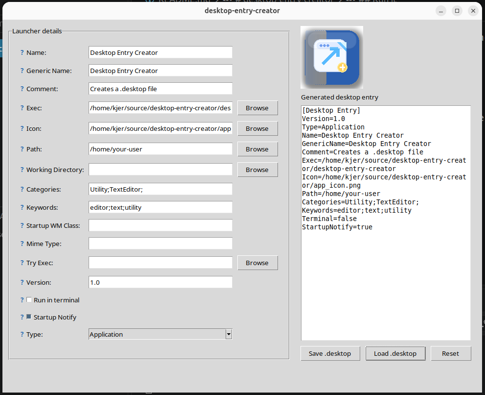

# Desktop Entry Creator

A small Python GUI app for creating `.desktop` launcher files for Linux desktops.

## Features

- Fill in launcher metadata using a simple form
- Generate a freedesktop-compatible `.desktop` file
- Preview the generated contents before saving
- Save the output to any location
- Generate an icon file with one click and save it next to the chosen `.desktop` file
- Tested on Ubuntu

## Install

Download repo files. Start `desktop_entry_creator` and create a desktop entry to it using the icon that is part of the files· 

## Developing or run it manually

```bash
./desktop-entry-creator
```

Or directly:

```bash
python3 desktop_entry_creator.py
```

You can also specify a filename as argument that will be the exec-suggestion for a desktop file (nice when starting from command line).

## Screendump


## Development
It is heavily AI developed, so don't blame me for the code.

It solves my problem with making desktop files.